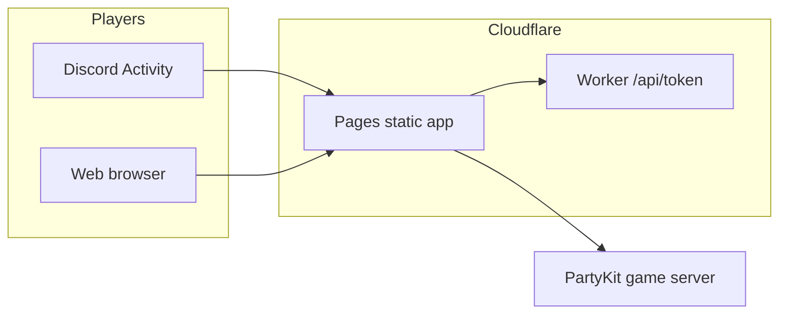

<div align="center">

# Imposter

**Real-time word imposter game** for [**Discord Activities**](https://discord.com/developers/docs/activities/overview) and the **open web** — React + Vite, [PartyKit](https://partykit.io/) multiplayer, Discord Embedded App SDK, Cloudflare Pages + Worker, optional Supabase profiles and stats.

[](https://nodejs.org/)
[](https://www.typescriptlang.org/)
[](https://react.dev/)
[](LICENSE)

**[Documentation hub](./docs/README.md)** · **[Contributing](./CONTRIBUTING.md)** · **[Security](./SECURITY.md)** · **[Launch plan](./docs/LAUNCH_PLAN.md)**

</div>

---

## Why this stack?

| Layer | Choice | Role |
|--------|--------|------|
| **UI** | React 19, Vite 8, Tailwind v4, shadcn/ui | Fast client; works in Discord iframe and browser |
| **Realtime** | PartyKit | Authoritative game room, WebSocket sync |
| **Discord OAuth** | Cloudflare Worker | Token exchange; never ship client secrets to the browser |
| **Hosting** | Cloudflare Pages | Static app + URL mappings for Activities |
| **Accounts (web)** | Supabase (optional) | Anonymous / email / Discord link, round history, saved word lists |



---

## Quick start

**Requirements:** Node **20+**, npm.

```bash
git clone <your-fork-or-repo-url>.git
cd imposter-game
npm install && cd server && npm install && cd ..
cp .env.example .env
# Edit .env — see table below and .env.example comments
```

| Terminal | Command |
|----------|---------|
| **1 — game server** | `npm run dev:party` |
| **2 — client** | `npm run dev` |

Open the URL Vite prints (usually `http://localhost:5173`). Outside Discord you get a **guest / web profile** flow; for Discord auth in dev, configure `DISCORD_CLIENT_ID` + `DISCORD_CLIENT_SECRET` in `.env` so `POST /api/token` works locally.

**Playwright / CI:** `VITE_DISCORD_MOCK=1` pins a mock user and hides the web profile bar — use only for automated tests, not normal play.

---

## Environment variables (essentials)

Full reference lives in **[`.env.example`](./.env.example)**. These are the ones you touch first:

| Variable | Scope | Purpose |
|----------|--------|---------|
| `VITE_DISCORD_CLIENT_ID` | Client build | Discord application ID |
| `VITE_PARTYKIT_HOST` | Client build | PartyKit host, e.g. `localhost:1999` or `your-party.username.partykit.dev` |
| `VITE_DISCORD_TOKEN_URL` | Client build | Worker URL for token exchange in **browser/PWA**; inside Discord the app uses mapped **`/api/token`** |
| `DISCORD_CLIENT_ID` / `DISCORD_CLIENT_SECRET` | Vite dev + Worker | Server-side OAuth (secret never `VITE_*`) |
| `VITE_SUPABASE_URL` + anon/publishable key | Optional web | Cloud profile, history, saved lists — see migrations in `supabase/migrations/` |

**Production deploy** uses **`.env.deploy`** (from [`.env.deploy.example`](./.env.deploy.example)) and `npm run deploy` — exact order and portal steps are in **[`docs/LAUNCH_PLAN.md`](./docs/LAUNCH_PLAN.md)**.

---

## Scripts

| Command | Description |
|---------|-------------|
| `npm run dev` | Vite dev server |
| `npm run dev:party` | PartyKit dev (`server/`) |
| `npm run build` | Production client build (`tsc` + Vite) |
| `npm run lint` | ESLint |
| `npm run test:e2e` | Playwright (start PartyKit on `127.0.0.1:1999` locally first) |
| `npm run deploy` | Worker secrets + Partykit + Pages (uses `.env.deploy`) |
| `npm run deploy:worker` / `deploy:partykit` / `deploy:pages` | Granular deploy steps |
| `npm run assets:brand` | Regenerate PNGs from SVGs (`sharp`) |
| `npm run gen:sfx` | Regenerate UI sound WAVs |

---

## Documentation map

| Doc | Use when |
|-----|----------|
| [**docs/README.md**](docs/README.md) | Index of all guides |
| [**docs/LAUNCH_PLAN.md**](docs/LAUNCH_PLAN.md) | Shipping to production (phases, Discord portal, verify) |
| [**docs/STAGING.md**](docs/STAGING.md) | Staging env + `DEPLOY_ENV_FILE` |
| [**docs/DISCORD_ACTIVITY_URLS.md**](docs/DISCORD_ACTIVITY_URLS.md) | URL mappings, legal URLs, checklist |
| [**docs/SECURITY.md**](docs/SECURITY.md) | `JOIN` hardening, JWT mode, rate limits |
| [**docs/POST_LAUNCH.md**](docs/POST_LAUNCH.md) | Post-deploy smoke checks |

---

## Project layout

```
imposter-game/
├── src/                 # React app (screens, hooks, i18n, components)
├── server/              # PartyKit project (room logic, word packs)
├── workers/             # Cloudflare Worker source (token / JWT)
├── e2e/                 # Playwright tests
├── scripts/             # deploy.mjs, release helpers, assets
├── supabase/migrations/ # Optional SQL for web profiles / stats / lists
├── docs/                # Runbooks and checklists
└── public/              # Static assets, sounds, legal pages
```

---

## Security & privacy

- Never commit **`.env`**, **`.env.deploy`**, or Discord **client secrets**.
- Prefer **`JOIN_VERIFY`** and/or **party JWT** for production rooms exposed on the public internet — see [**docs/SECURITY.md**](docs/SECURITY.md).
- **Vulnerability reports:** [**SECURITY.md**](SECURITY.md) (private disclosure).

---

## Contributing

See [**CONTRIBUTING.md**](CONTRIBUTING.md) for local setup, checks, and PR expectations.

---

## License

[MIT](LICENSE) — see file for full text. If you fork for your own Discord app, update branding and legal pages under `public/` to match your product.

---

## Acknowledgements

Built with [PartyKit](https://partykit.io/), [Discord Embedded App SDK](https://github.com/discord/embedded-app-sdk), [Cloudflare Workers & Pages](https://developers.cloudflare.com/), and [Supabase](https://supabase.com/) (optional).
