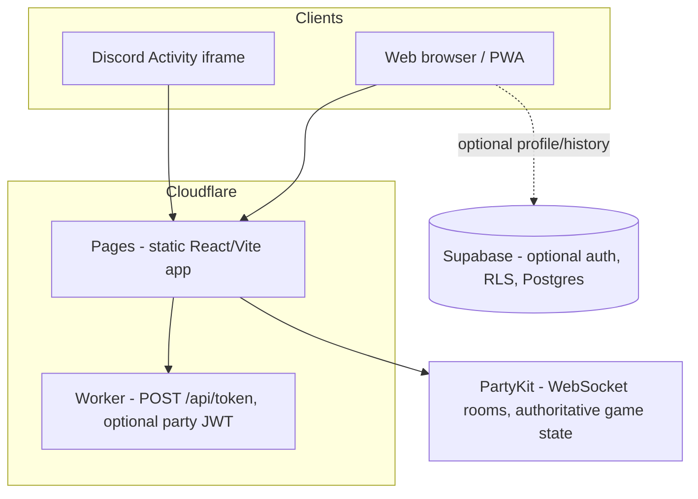

# Imposter — portfolio & handoff brief

**Purpose:** Give another agent (or a portfolio site generator) enough context to describe this project accurately: what it does, why the stack is interesting, and where it lives online. **Replace bracketed placeholders** with your current production URLs from Cloudflare / PartyKit / Discord.

---

## One-line pitch

**Imposter** is a real-time, multiplayer “word imposter” party game: players get a secret word (or a different word as the imposter), write one-word clues across timed rounds, then vote. It ships as a **Discord Activity** (voice-channel embedded app) **and** a standalone **web/PWA** experience, sharing one React client and one authoritative **PartyKit** game server.

---

## What the product does (player-facing)

1. **Lobby** — Host configures word packs or custom word pairs, timers, vote duration, optional rules (e.g. new random words each clue round, rotating host). Web players get shareable lobby codes and invite links.
2. **Clue rounds** — Timed one-word clues; server enforces format (strict Unicode letters by default). Spectators can watch mid-round.
3. **Clue reveal** — All clues shown; optional suspicion marks; anyone can call a vote; host advances rounds or opens voting.
4. **Voting** — Timed voting with skip vs accuse; server resolves outcome when votes complete or time expires.
5. **Reveal** — Outcome, words, vote breakdown; host can start next round or return to lobby.
6. **Web-only extras (optional Supabase)** — Cloud identity (guest / anonymous / email / Discord-linked), display name + emoji preset avatars, per-user round history, aggregated stats, saved word lists synced to account.

---

## Surfaces & distribution

| Surface | How users get in | Notes |
|--------|-------------------|--------|
| **Discord Activity** | Launch from a voice channel; iframe loads your Pages URL with URL mappings for `/` and `/api/token` | OAuth token exchange proxied so the **client secret never ships to the browser** |
| **Open web** | Same static app on Cloudflare Pages; `VITE_DISCORD_TOKEN_URL` points at Worker for browser Discord login when desired | Guest/sessionStorage identity by default; optional Supabase for persistence |

---

## Architecture (high level)



- **Single source of truth for gameplay:** PartyKit `ImposterRoom` holds room state, validates messages, advances phases, and broadcasts snapshots to connected clients.
- **Split Worker config:** Root `wrangler.toml` targets Pages; `wrangler.worker.toml` deploys the OAuth/JWT worker (`scripts/deploy.mjs` orchestrates order: worker → partykit → pages).

---

## Tech stack (concrete)

| Area | Choices |
|------|---------|
| **UI** | React 19, Vite 8, TypeScript 5.9, Tailwind CSS v4, shadcn-style UI (Radix primitives, CVA), `tw-animate-css` |
| **i18n** | `i18next` + `react-i18next`; English base + Spanish overrides pattern |
| **Realtime** | PartyKit (`server/`), `partysocket` on client |
| **Discord** | `@discord/embedded-app-sdk`, Activities URL mappings |
| **Auth (browser)** | Cloudflare Worker exchanges OAuth `code` for tokens; optional Supabase Auth (anon, email, Discord) |
| **Data (optional)** | Supabase Postgres + RLS; migrations in `supabase/migrations/` (profiles → Discord link column → rounds → saved lists → stats → usage events + SQL views) |
| **Quality** | ESLint, Playwright e2e (`e2e/`), GitHub Actions CI |
| **Deploy** | Node orchestration script; Wrangler Pages deploy; PartyKit CLI deploy |

---

## Technically impressive / differentiation (talking points)

Use these verbatim or shorten for case studies / interviews.

1. **Dual-runtime client, one game server** — Same React app runs inside Discord’s constrained iframe (CSP, URL mappings) and in a normal browser, talking to the same PartyKit host. Requires careful handling of token URLs (`/api/token` in Discord vs full Worker URL on web).

2. **Authoritative multiplayer state machine** — All game rules (phases, timers, clue validation, voting, imposter selection, host rotation, end-game) live server-side in TypeScript; clients send intent messages (`JOIN`, `START_GAME`, `SUBMIT_CLUE`, `CAST_VOTE`, etc.) and render state. Reduces cheating surface vs trust-the-client.

3. **Production-oriented join security** — Documented threat model: guessable room IDs + crafted `JOIN` payloads. Mitigations include optional **Discord token verification** on join, optional **short-lived party JWT** minted by the Worker, **trimmed/length-limited** identity fields, and **sliding-window rate limits** on `JOIN` per connection and per `userId` (`docs/SECURITY.md`).

4. **Configurable game design at runtime** — Host settings: write timer, max clue rounds, vote timer, word pack vs custom pairs, “new random words each clue round,” “rotate host each round,” strict vs lenient clue tokens (`CLUE_STRICT_WORD`), all merged into shared state.

5. **Unicode-aware clue policy** — Default strict clues use `\p{L}` (letters including accented characters), aligned between client input sanitization and server rejection codes (`CLUE_STRICT_REJECTED` vs `INVALID_CLUE`).

6. **Optional cloud profile without forcing accounts** — Web users can play as guest (device-local identity) or opt into Supabase anonymous / email / Discord-linked sessions with **RLS-protected** tables for profiles, round history, stats triggers, saved word lists, and append-only usage events for analytics-shaped queries.

7. **Polished UX layer** — Themed palettes + system/light/dark; localized strings; accessible confirm flows (Radix **Alert Dialog** instead of `window.confirm`); **phase cross-fades** between lobby and play; collapsible **account panel** with CSS `grid-template-rows` height animation and `inert` when collapsed; SFX with reduced-motion awareness; haptics hooks where supported.

8. **Deploy pipeline as code** — `npm run deploy` reads `.env.deploy`, pushes Worker secrets, deploys PartyKit with env vars, builds Vite with baked `VITE_*`, uploads Pages — documented in `docs/LAUNCH_PLAN.md` with phase ordering (e.g. Worker URL must exist before client bake).

---

## Repository map (for another agent)

| Path | Role |
|------|------|
| `src/App.tsx` | Shell, phase routing, `PhaseScreenTransition`, Discord vs web chrome |
| `src/hooks/useParty.ts` | WebSocket lifecycle, message merge, game settings defaults |
| `src/hooks/useDiscord.ts` | Web session, Supabase profile hooks, lobby join/create |
| `src/types/game.ts` | Client/server shared message and state types (keep in sync with server) |
| `server/src/room.ts` | PartyKit room: state, message handlers, timers, validation |
| `workers/` | Cloudflare Worker: Discord OAuth token route, optional JWT minting |
| `supabase/migrations/` | Ordered SQL: profiles, rounds, lists, stats, usage |
| `docs/LAUNCH_PLAN.md` | Production checklist, example deploy hostnames |
| `docs/SECURITY.md` | Join abuse model and env toggles |
| `docs/USER_FEEDBACK_BACKLOG.md` | Shipped features vs roadmap |
| `docs/FRIENDS_ROADMAP.md` | Future social graph scope |

---

## Links to fill in (portfolio site)

**Replace the placeholders** with values from your Cloudflare dashboard, PartyKit dashboard, and Discord Developer Portal. Example shape (from internal launch notes — **verify before publishing**):

| Role | Placeholder | Where to find / example pattern |
|------|-------------|----------------------------------|
| **Live game (Pages)** | `https://YOUR_PROJECT.pages.dev` or custom domain | Cloudflare Pages → project → Domains |
| **Discord OAuth Worker** | `https://YOUR_WORKER.workers.dev` | Workers & Pages → Workers → your worker |
| **Token endpoint (full URL)** | `https://YOUR_WORKER.workers.dev/api/token` | Same; used as `VITE_DISCORD_TOKEN_URL` for web builds |
| **PartyKit host (hostname only)** | `your-deployment.username.partykit.dev` | PartyKit deploy output; `VITE_PARTYKIT_HOST` has **no** `https://` |
| **Discord Application** | `https://discord.com/developers/applications/YOUR_APP_ID` | Developer Portal |
| **Source** | Your public Git remote | e.g. GitHub/GitLab URL |

**Recorded in-repo examples** (may drift after redeploys — confirm in `docs/LAUNCH_PLAN.md` “Recorded deploy outputs”):

- Worker hostname cited: `imposter-discord-oauth.humzab1711.workers.dev` → token at `/api/token`
- PartyKit host cited: `server.hum2a.partykit.dev`
- Pages: pattern `*.imposter-game-*.pages.dev` (exact name from dashboard)

---

## Suggested portfolio page sections

1. **Hero** — Name, one-line pitch, primary CTA (“Play on web” / “Add to Discord server” if you have a listing).
2. **Problem** — Social games need low-latency sync, anti-abuse basics, and two different embedding contexts (Discord + web).
3. **Solution** — Stack diagram + bullet list of authoritative server + Worker + optional Supabase.
4. **Highlights** — Pick 3–5 items from “Technically impressive” above; add screenshots (lobby, clue write, voting, reveal).
5. **My role** — Fill in: solo / team, focus areas (full-stack, realtime, DevOps, etc.).
6. **Links** — Live app, GitHub (if public), Discord app directory (if listed).

---

## Commands a reviewer might run

```bash
npm install && cd server && npm install && cd ..
npm run build      # tsc + Vite production build
npm run lint
# e2e: start PartyKit on 127.0.0.1:1999, then:
npm run test:e2e
```

---

## License & attribution

MIT (see repo `LICENSE`). Third-party: PartyKit, Discord Embedded App SDK, Cloudflare, Supabase — see `README.md` acknowledgements.

---

*Generated as a handoff artifact for portfolio use. Update placeholders and redeploy URLs whenever production changes.*
